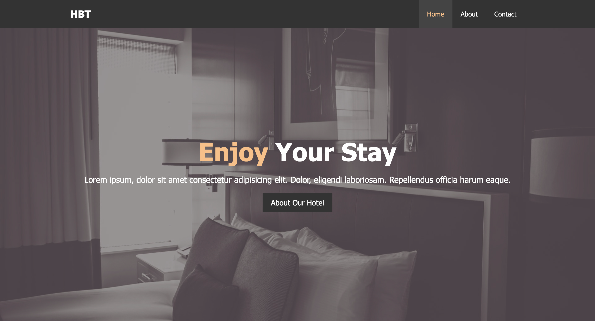

# HOTEL-BT

> A stylish and modern hotel website built using HTML & CSS. This was my first project after learning the fundamentals of web development.

## 🚀 Live Demo

[Check it out here](https://junaidqureshi05.github.io/HOTEL-BT/)

## 📌 Features

- 🌟 Elegant and responsive design
- 📜 Well-structured HTML & CSS
- 🎨 Smooth hover effects and transitions
- 📱 Mobile-friendly layout
- 📍 Google Maps integration

## 🛠️ Technologies Used

- HTML5
- CSS3
- FontAwesome (for icons)
- Google Fonts

## 📷 Screenshots



## 🏗️ Installation & Usage

1. Clone the repository:
   ```sh
   git clone https://github.com/junaidqureshi05/HOTEL-BT.git
   ```
2. Open `index.html` in your browser.

## 🔥 What's Next?

- Adding more interactive elements with JavaScript
- Enhancing styling with modern CSS frameworks like Tailwind or Bootstrap
- Improving accessibility and SEO

## 🤝 Contributing

Feel free to fork the repository and submit pull requests to improve the project!

## 📜 License

This project is open-source and available under the [MIT License](LICENSE).

---

💻 Built with passion by Junaid
